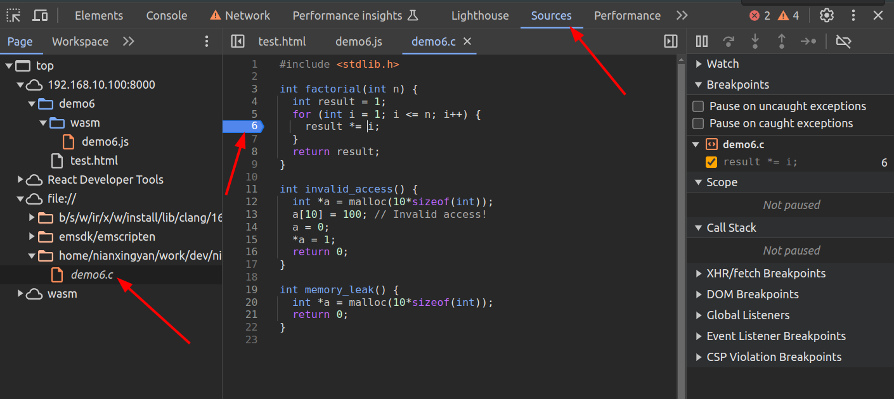

# Demo5说明：

调试WASM有两种方法：
1. 先编译为可执行文件，对可执行文件进行调试（比如通过GDB等工具）
  - 需要单独写一个可执行文件，并对可执行文件做编译配置
2. 编译为WASM，通过浏览器调试
  - 调试不直观，尤其内存问题不好排查

下面介绍如何在浏览器中进行调试。

## 编译选项

> 参考： https://emscripten.org/docs/porting/Debugging.html

主要增加了几个编译参数： `-g -s ASSERTIONS=2 -s SAFE_HEAP=1 -s STACK_OVERFLOW_CHECK=2 -fsanitize=undefined`，具体说明可参考上述文档

## 在浏览器中调试

请使用Chrome浏览器，并参考这篇文章：https://developer.chrome.com/blog/wasm-debugging-2020?hl=zh-cn

在调试时，可以提前在浏览器的Sources面板中找到WASM源文件，并在合适的位置下断点，比如：

## Code说明

开启相关选项后，并没有像预期中一样能上报一些内存错误。
